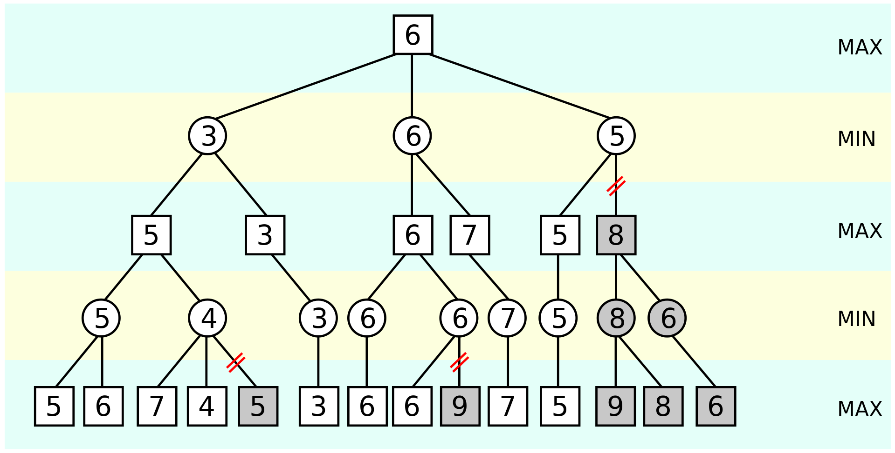
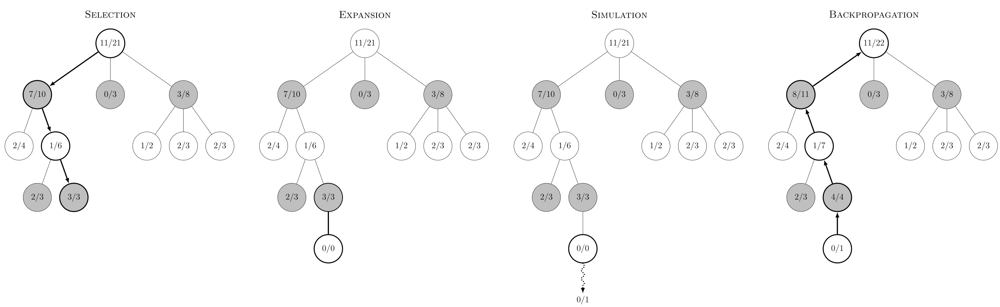
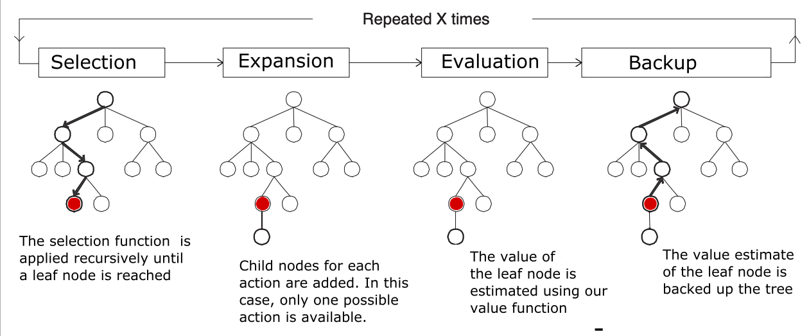
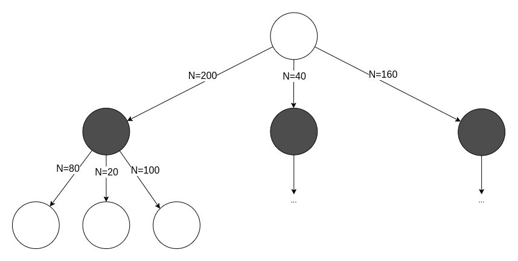
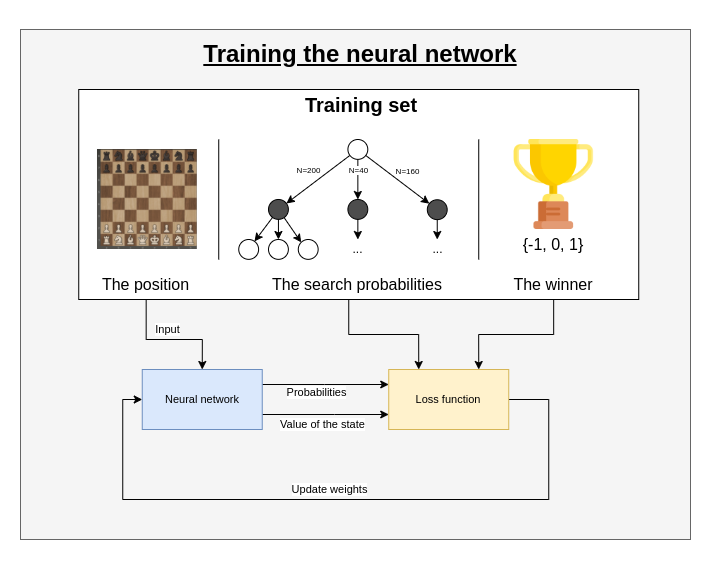
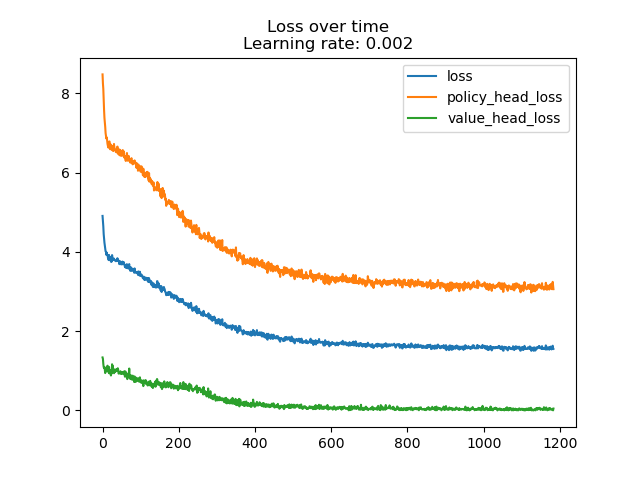
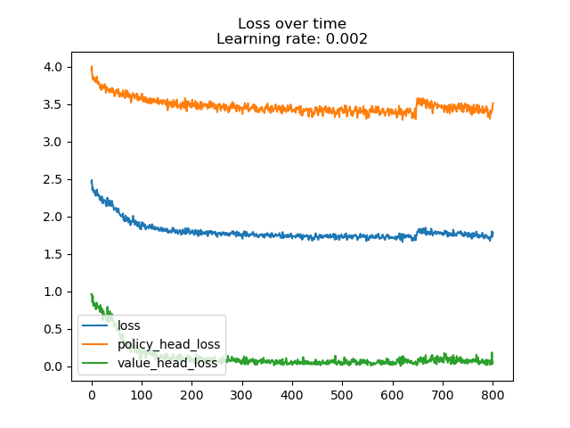
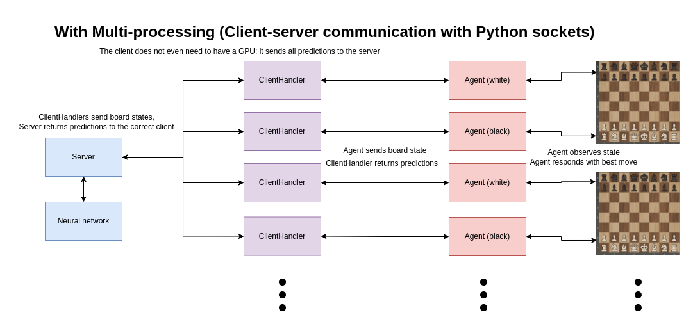

# Chess engine with Deep Reinforcement learning

To download my pretrained model, use this link: https://studenthowest-my.sharepoint.com/:u:/g/personal/tuur_vanhoutte_student_howest_be/ERs9S6KqbtdGgC9eVunsjJcBR0VRuUnbGnTmOaWde6Utvw

Put the model.h5 file in the models/ folder.

## How do normal chess engines work?

Normal chess engines work with the minimax algorithm: the engine tries to find the best move by creating a tree of all possible moves to a certain depth, and cutting down paths that lead to bad positions (alpha-beta pruning). It evaluates a position based on which pieces are on the board.



> Image source: By Jez9999, CC BY-SA 3.0, https://commons.wikimedia.org/w/index.php?curid=3708424

## How does my chess engine work?

This chess engine is based on AlphaZero by Deepmind. It uses a neural network
to predict the next best move. The neural network learns by playing against
itself for a high amount of games, and using their results to train the network.
The newly trained neural network is evaluated against the old network by playing
many games against each other, and the best network is kept. This process is repeated
for a long time.


Every move, run a high number amount of MCTS simulations. AlphaZero uses an custom version of MCTS.

### Normal Monte Carlo Tree Search:

https://en.wikipedia.org/wiki/Monte_Carlo_tree_search

1. **Selection:** Traverse the tree **randomly** until a leaf node is reached.
2. **Expansion:** expand the leaf node by creating a child for every possible action
3. **Simulation:** 'rollout' the game by randomly choosing moves until the end of the game.
4. **Backpropagation:** backpropagate the result of the rollout to the root node.

In chess, normal MCTS would be incredibly inefficient, because the amount of actions
every position can have is too high (step 1), and the length of the game can be very long
when choosing random moves (step 3).



> Image source: By Rmoss92 - Own work, CC BY-SA 4.0, https://commons.wikimedia.org/w/index.php?curid=88889583

### AlphaZero's MCTS

AlphaZero uses a different kind of MCTS: 

* step 1 (Selection) is not random, but based on neural network predictions and upper confidence bound
* step 3 (Simulation) is replaced by the value prediction received by the neural network (Evaluation)



> Image source: https://sebastianbodenstein.net/post/alphazero/

**To run one MCTS simulation:**

1. To traverse the tree, keep selecting the edges with maximum Q+U value
	* Q = mean value of the state over all simulations
	* U = upper confidence bound
	* Do this until a leaf node is reached (= a node which has not been visited/expanded yet)
2. Expand the leaf node by adding a new edge for every possible action in the state
	* Input the leaf node into the neural network
	* The output:
		1) The probabilities 
		2) The value of the state
	* Initialize the new edge's variables with these values:
		* `N = 0`
		* `W = 0` 
		* `Q = 0`
		* `P = p_a` (prior probability for that action)
	* Add nodes (new states) for each action to the tree
3. Backpropagation
	* From the leaf node, backpropagate to the root node
	* For every edge in the path, update the edge's variables
		* `N = N + 1`
		* `W = W + v`, v is the value of the leaf node predicted by the NN in step 2.
		* `Q = W / N`

### After these simulations, the move can be chosen:

* The move with greatest $N$ (deterministically)
* According to a distribution (stochastically): $\pi \sim N$




### Creating a training set

* To train the network, you need a lot of data
* You create this data through self-play: letting the AI play against a copy of itself for many games.
* For every move, store:
	* The state
	* The search probabilities
	* The winner, (added once the game is over)

### Training the network

* Sample a mini-batch from a high amount of positions (see training set)
* Train the network on the mini-batch



> Trophy icon by Freepik https://www.flaticon.com/authors/freepik


| First training session | Second training session |
|:-:| :-: |
| |  |

### Evaluate the network

To know whether the new network is better than the previous one, let the new network play against the previous best for a high amount of games. Whoever wins the most games, is the new best network.

Use that network to self-play again. Repeat indefinitely.

I tried this with the newest network against a completely random neural network. These are the results after 10 games:

```
Evaluated these models: Model 1 = models/randommodel.h5, Model 2 = models/model.h5
The results:
Model 1: 0
Model 2: 5
Draws: 5
```


### Multi-processing improvements




With a good system as a server (Ryzen 7 5800H + RTX 3070 Mobile), multiple clients (including clients on the system itself) can be connected to the server. 

The result: much faster self-play. The other clients' GPUs do not get used, meaning any system with a good processor can run multiple self-play games in parallel when connected to a server.


|System|No multiprocessing|Multiprocessing (16 processes)|
|:-|:-------------------:|:-------------------:|
|R7 5800H + RTX 3070|50 sims/sec|30 sims/sec each process|
|i7 7700HQ + GTX 1050|20 sims/sec|15 sims/sec each process|

I dockerized this server-client system so it can be deployed on a cluster.
You can find the configuration in code/docker-compose.yml, and the Dockerfiles in code/Dockerfile{client,server}.
The docker images are also pushed to `ghcr.io`: 

* The server: https://ghcr.io/zjeffer/chess-rl_prediction-server:latest
	* There is also a special server image if you're using an older Nvidia version (470 and CUDA 11.4): 
	* https://ghcr.io/zjeffer/chess-rl_prediction-server:cuda-11.4
* The client: https://ghcr.io/zjeffer/chess-rl_selfplay-client:latest

# Installation and user manual

The installation manual and the user manual can both be found under `./documents/`

# Sources

### Wikipedia articles & Library documentation

* https://en.wikipedia.org/wiki/Deep_reinforcement_learning
* https://en.wikipedia.org/wiki/Reinforcement_learning
* https://en.wikipedia.org/wiki/AlphaZero
* https://en.wikipedia.org/wiki/AlphaGo & https://en.wikipedia.org/wiki/AlphaGo_Zero
* https://en.wikipedia.org/wiki/Monte_Carlo_tree_search
* https://en.wikipedia.org/wiki/Minimax What stockfish uses
* https://en.wikipedia.org/wiki/Alpha-beta_pruning What stockfish uses
* https://python-chess.readthedocs.io/en/latest/ Python chess library
* https://github.com/LeelaChessZero/lc0/wiki/Technical-Explanation-of-Leela-Chess-Zero  LC0's technical explanation


### AlphaZero & AlphaGo Zero specific articles & papers

* https://arxiv.org/abs/1712.01815 The AlphaZero paper
* https://www.science.org/doi/10.1126/science.aar6404 Supplementary materials for the paper: more info
* https://chess.stackexchange.com/questions/19353/understanding-alphazero How does AZ come to a decision?
* https://chess.stackexchange.com/questions/19401/how-does-alphazero-learn-to-evaluate-a-position-it-has-never-seen Never-seen positions
* https://www.nature.com/articles/nature24270/figures/2 From AlphaGo Zero paper: MCTS 
* https://joshvarty.github.io/AlphaZero/ and https://github.com/JoshVarty/AlphaZeroSimple AZ on simple Connect2 environment
* https://chess.stackexchange.com/a/37477 Explanation for input and output formats of neural network 
* https://tmoer.github.io/AlphaZero/ AlphaZero implementation for Atari game, with TensorFlow
* https://sebastianbodenstein.net/post/alphazero/ Great explanation about AZ's variant of MCTS 

### Diagrams

* https://medium.com/applied-data-science/alphago-zero-explained-in-one-diagram-365f5abf67e0  Useful diagram for AlphaGo Zero


### Tutorials

* https://towardsdatascience.com/alphazero-a-novel-reinforcement-learning-algorithm-deployed-in-javascript-56018503ad18 More info about the algorithm
* https://medium.com/applied-data-science/how-to-build-your-own-alphazero-ai-using-python-and-keras-7f664945c188
* https://medium.com/applied-data-science/how-to-build-your-own-muzero-in-python-f77d5718061a
* http://web.stanford.edu/~surag/posts/alphazero.html Simple Alpha Zero tutorial
* https://towardsdatascience.com/alphazero-implementation-and-tutorial-f4324d65fdfc AlphaGo Zero using custom TensorFlow operations and a custom Python C module 
	* Updated article: https://medium.com/analytics-vidhya/how-i-trained-a-self-supervised-neural-network-to-beat-gnugo-on-small-7x7-boards-6b5b418895b7
	* https://github.com/cody2007/alpha_go_zero_implementation The Github repo associated with this tutorial


## Interesting videos

* https://www.youtube.com/watch?v=uPUEq8d73JI Lex Fridman + David Silver
* https://www.youtube.com/watch?v=2pWv7GOvuf0 Lecture RL from David Silver
* https://www.youtube.com/watch?v=A3ekFcZ3KNw: Keynote David Silver NIPS 2017