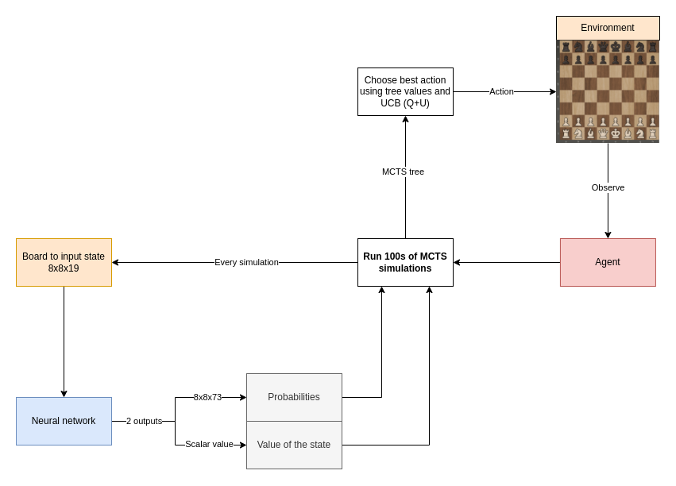
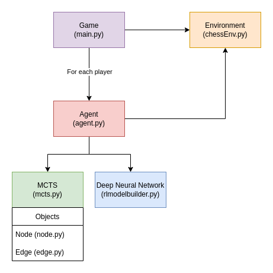

# Chess engine using Deep Reinforcement learning

# How does it work?

### Every move, run a high number amount of MCTS simulations:

> Image source: https://sebastianbodenstein.net/post/alphazero/

**To run one MCTS simulation:**

1. To traverse the tree, keep selecting the edges with maximum Q+U value
	* Q = mean value of the state over all simulations
	* U = upper confidence bound
	* Do this until a leaf node is reached
2. Expand the leaf node by adding a new edge for every possible action in the state
	* Input the leaf node into the neural network
	* The output:
		1) The probabilities 
		2) The value of the state
	* Initialize the new edge's variables with these values:
		* `N = 0`
		* `W = 0` 
		* `Q = 0`
		* `P = p_a` (prior probability for that action)
	* Add nodes (new states) for each action to the tree
3. Backpropagation
	* From the leaf node, backpropagate to the root node
	* For every edge in the path, update the edge's variables
		* `N = N + 1`
		* `W = W + v`, v is the value of the leaf node predicted by the NN in step 2.
		* `Q = W / N`

### After these simulations, the move can be chosen:

* The move with greatest $N$ (deterministically)
* According to a distribution (stochastically): $\pi \sim N^{\frac{1}{T}}$, T = temperature control

### Creating a training set

* For every move, store:
	* The state
	* The search probabilities
	* The winner, (added once the game is over)

### Training the network

* Sample a mini-batch from a high amount of games
* Train the network on the mini-batch
* Use a custom loss function (TODO)

### Evaluate the network

To know whether the new network is better than the previous one, let the new network play
against the previous best for a high amount of games. Whoever wins the most games, is the new best network.

### Class structure

Each player needs to have its own agent object. Every agent has its own 
MCTS tree and neural network.

# Useful sources

### Wikipedia articles & Library documentation

* https://en.wikipedia.org/wiki/Deep_reinforcement_learning
* https://en.wikipedia.org/wiki/Reinforcement_learning
* https://en.wikipedia.org/wiki/AlphaZero
* https://en.wikipedia.org/wiki/AlphaGo & https://en.wikipedia.org/wiki/AlphaGo_Zero
* https://en.wikipedia.org/wiki/Monte_Carlo_tree_search
* https://en.wikipedia.org/wiki/Minimax What stockfish uses
* https://en.wikipedia.org/wiki/Alpha-beta_pruning What stockfish uses
* https://python-chess.readthedocs.io/en/latest/ Python chess library
* https://github.com/LeelaChessZero/lc0/wiki/Technical-Explanation-of-Leela-Chess-Zero  LC0's technical explanation

### AlphaZero & AlphaGo Zero specific articles & papers

* https://arxiv.org/abs/1712.01815 The AlphaZero paper
* https://www.science.org/doi/10.1126/science.aar6404 Supplementary materials for the paper: more info
* https://chess.stackexchange.com/questions/19353/understanding-alphazero How does AZ come to a decision?
* https://chess.stackexchange.com/questions/19401/how-does-alphazero-learn-to-evaluate-a-position-it-has-never-seen Never-seen positions
* https://www.nature.com/articles/nature24270/figures/2 From AlphaGo Zero paper: MCTS 
* https://joshvarty.github.io/AlphaZero/ and https://github.com/JoshVarty/AlphaZeroSimple AZ on simple Connect2 environment
* https://chess.stackexchange.com/a/37477 Explanation for input and output formats of neural network 
* https://tmoer.github.io/AlphaZero/ AlphaZero implementation for Atari game, with TensorFlow
* https://sebastianbodenstein.net/post/alphazero/ Great explanation about AZ's variant of MCTS 

### Diagrams

* https://medium.com/applied-data-science/alphago-zero-explained-in-one-diagram-365f5abf67e0  Useful diagram for AlphaGo Zero

### Tutorials

* https://towardsdatascience.com/alphazero-a-novel-reinforcement-learning-algorithm-deployed-in-javascript-56018503ad18 More info about the algorithm
* https://medium.com/applied-data-science/how-to-build-your-own-alphazero-ai-using-python-and-keras-7f664945c188
* https://medium.com/applied-data-science/how-to-build-your-own-muzero-in-python-f77d5718061a
* http://web.stanford.edu/~surag/posts/alphazero.html Simple Alpha Zero tutorial
* https://towardsdatascience.com/alphazero-implementation-and-tutorial-f4324d65fdfc AlphaGo Zero using custom TensorFlow operations and a custom Python C module 
	* Updated article: https://medium.com/analytics-vidhya/how-i-trained-a-self-supervised-neural-network-to-beat-gnugo-on-small-7x7-boards-6b5b418895b7
	* https://github.com/cody2007/alpha_go_zero_implementation The Github repo associated with this tutorial

## Interesting videos

* https://www.youtube.com/watch?v=uPUEq8d73JI Lex Fridman + David Silver
* https://www.youtube.com/watch?v=2pWv7GOvuf0 Lecture RL from David Silver
* https://www.youtube.com/watch?v=A3ekFcZ3KNw: Keynote David Silver NIPS 2017